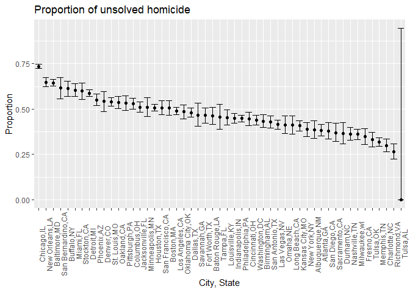
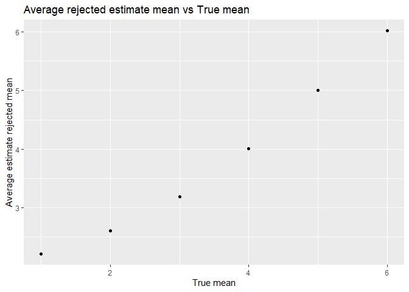
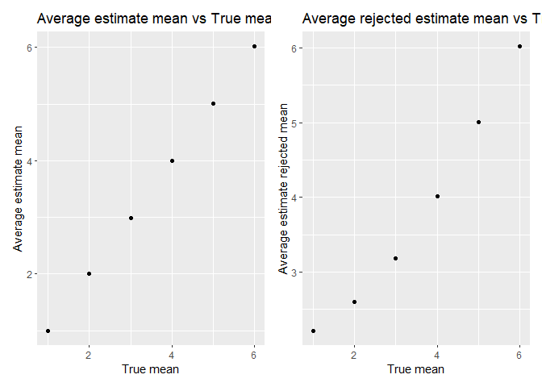

8105_yh3555_hw5
================
Yuchen Hua
2022-11-13

# Problem 1

``` r
fulldata = 
    tibble(
    files = list.files("data/data1/"),
    path = str_c("data/data1/", files)
) %>%
  mutate(data = map(path, read.csv)) %>%
  unnest()
```

    ## Warning: `cols` is now required when using unnest().
    ## Please use `cols = c(data)`

The data were imported and combined together by tibble functions. A
dataframe was created to include all the files in the directory. Path to
each file was created. The paths was mapped and the data was imported by
“read_csv” function. The result of “map” was unnested in the end.

``` r
tidydf = fulldata %>%
  mutate( 
    files = str_replace(files, ".csv", ""),
    group = str_sub(files, 1, 3)) %>%
  pivot_longer(
    week_1:week_8,
    names_to = "week",
    values_to = "outcome",
    names_prefix = "week_") %>%
  mutate(week = as.numeric(week)) %>%
  select(group, subj = files, week, outcome)
```

The data had been wide rather than long, so it should be cleaned up via
pivot_longer.

``` r
tidydf %>%
  ggplot(aes(x = week, y = outcome, group = subj, color = group)) +
  geom_point() +
  geom_path() +
  facet_grid(~group)
```

<!-- --> Plot
was created to show individuao data, facted by group.

# Problem 2

``` r
homicide = read.csv("./data/data2/homicide-data.csv")
```

There were 52179 cases recorded from 50 cities. There were total 12
variables put into observation. The victim’s first and last names were
recorded, together with their race, age and sex.

\_\_

``` r
homicide = homicide %>%
  mutate(city_state = str_c(city, ",", state)) %>%
  mutate(city_state = as.factor(city_state))
```

``` r
total = homicide %>%
  group_by(city_state) %>%
  summarize(total_homicide = n()) %>% 
  arrange(desc(total_homicide))
```

Among all 51 cities, Chicago has the most number of homicide, to be 5535
and Philadelphi has the second rank, with 3037 homicide.

``` r
unsolved = homicide %>%
  group_by(city_state, disposition) %>% 
  filter(disposition %in% c("Closed without arrest", "Open/No arrest")) %>% 
  summarize(case = n()) %>%
  pivot_wider(names_from = disposition, values_from = case) %>%
  janitor::clean_names() %>%
  replace_na(list(closed_without_arrest = 0, open_no_arrest = 0)) %>%
  mutate(total_unsolved = sum(closed_without_arrest, open_no_arrest)) %>% 
  arrange(desc(total_unsolved))
```

    ## `summarise()` has grouped output by 'city_state'. You can override using the
    ## `.groups` argument.

By grouping the city_state with disposition, “closed without arrest” and
“Open/No arrest” were filtered. These two types of cases underwent
pivot_wider function to be variables so that the number of cases in each
city_state can be found via summarize(). The total number of unsolved
cases is the the sum of that of `Closed without arrest` and
`Open/No arrest`. The na is replaced with 0. In this tibble, we can find
that Chicago, IL still have the most total unsolved cases, to be 4073
cases, with 3686 “Open/No arrest”. The second one, Baltimore, MD, have
1825 unsolved cases, with 1673 “Open/No arrest.

``` r
homicide_bycase = homicide %>%
  group_by(city_state, disposition) %>% 
  summarize(case = n()) %>%
  pivot_wider(names_from = disposition, values_from = case) %>% 
  janitor::clean_names() %>%
  replace_na(list(closed_by_arrest =0, closed_without_arrest = 0, open_no_arrest = 0)) %>%
  mutate(total_unsolved = sum(closed_without_arrest, open_no_arrest),
         total_case = sum(closed_without_arrest, open_no_arrest,closed_by_arrest)) %>% 
  select(city_state, total_unsolved, total_case)
```

    ## `summarise()` has grouped output by 'city_state'. You can override using the
    ## `.groups` argument.

``` r
homicide_bycase
```

    ## # A tibble: 51 × 3
    ## # Groups:   city_state [51]
    ##    city_state     total_unsolved total_case
    ##    <fct>                   <int>      <int>
    ##  1 Albuquerque,NM            146        378
    ##  2 Atlanta,GA                373        973
    ##  3 Baltimore,MD             1825       2827
    ##  4 Baton Rouge,LA            196        424
    ##  5 Birmingham,AL             347        800
    ##  6 Boston,MA                 310        614
    ##  7 Buffalo,NY                319        521
    ##  8 Charlotte,NC              206        687
    ##  9 Chicago,IL               4073       5535
    ## 10 Cincinnati,OH             309        694
    ## # … with 41 more rows

The tibble was rearranged by mutate the cases into total_unsolved and
total. To find the proportion, only city_state, total_unsolved and total
variable were requried. Thus, only these 3 varibales were selected.

``` r
propt = function(x,n) {
  prop.test(x,n) %>%
    broom::tidy() %>%
    select(estimate, conf.low, conf.high)
}
```

``` r
baltimore = homicide_bycase %>%
  filter(city_state == c("Baltimore,MD"))
prop_bal = baltimore %>%
  mutate(bal_prop = map2(.x = total_unsolved, .y = total_case, .f= ~propt(x = .x, n = .y))) %>%
  unnest(bal_prop) %>%
  select(-total_unsolved, -total_case)
prop_bal
```

    ## # A tibble: 1 × 4
    ## # Groups:   city_state [1]
    ##   city_state   estimate conf.low conf.high
    ##   <fct>           <dbl>    <dbl>     <dbl>
    ## 1 Baltimore,MD    0.646    0.628     0.663

By using prop.test, aftering pull the total_unsolved and total variable
from filterd Baltimore, the proportion was calculated. The Estaimated
proportion is 0.646, while confidence interval(0.628, 0.633).

``` r
prop_city = homicide_bycase %>%
  mutate(city_prop = map2(.x = total_unsolved, .y = total_case, .f= ~propt(x = .x, n = .y))) %>%
  unnest(city_prop) %>% 
  select(-total_unsolved, -total_case)
```

    ## Warning in prop.test(x, n): Chi-squared近似算法有可能不准

``` r
prop_city
```

    ## # A tibble: 51 × 4
    ## # Groups:   city_state [51]
    ##    city_state     estimate conf.low conf.high
    ##    <fct>             <dbl>    <dbl>     <dbl>
    ##  1 Albuquerque,NM    0.386    0.337     0.438
    ##  2 Atlanta,GA        0.383    0.353     0.415
    ##  3 Baltimore,MD      0.646    0.628     0.663
    ##  4 Baton Rouge,LA    0.462    0.414     0.511
    ##  5 Birmingham,AL     0.434    0.399     0.469
    ##  6 Boston,MA         0.505    0.465     0.545
    ##  7 Buffalo,NY        0.612    0.569     0.654
    ##  8 Charlotte,NC      0.300    0.266     0.336
    ##  9 Chicago,IL        0.736    0.724     0.747
    ## 10 Cincinnati,OH     0.445    0.408     0.483
    ## # … with 41 more rows

The plot was created to show the cities’ estimates and CIs, together
with error bars.

``` r
plot_homicide = prop_city %>%
  ggplot(aes(x=fct_reorder(city_state, -estimate), y=estimate)) + 
  geom_bar(stat = "identity", fill="lightgreen") + 
  geom_errorbar(aes(ymin = conf.low, ymax= conf.high)) + 
  labs(x = "City, State", y = "Proportion", title = "Proportion of unsolved homicide") + 
  theme(axis.text.x = element_text(angle = 90))
plot_homicide
```

<!-- -->

## Problem 3

**Create the function**

``` r
ttest = function(n = 30, mean, sd=5){
  data = rnorm(n=30, mean, sd=5)
  results = t.test(data, conf.level = 0.95)
  
  results %>%
    broom::tidy() %>% 
    select(estimate, p.value)
}
```

Let’s run the mean= 0 for

``` r
mean_0 = rerun(5000, ttest(mean=0)) %>%
  bind_rows
```

Let’s repeat mean = {1, 2, 3, 4, 5, 6}

``` r
mean_1_6 = 
  tibble(mean = c(1, 2, 3, 4, 5, 6)) %>%
  mutate(
    output = map(.x =mean, ~rerun(5000, ttest(mean = .x))),
    estimate = map(output, bind_rows) ) %>%
  select(-output) %>%
  unnest(estimate)
```

The dataset with mean from 1 to 6 was created.

Make a plot showing the average estimate of μ^ on the y axis and the
true value of μ on the x axis. Make a second plot (or overlay on the
first) the average estimate of μ^ only in samples for which the null was
rejected on the y axis and the true value of μ on the x axis. Is the
sample average of μ^ across tests for which the null is rejected
approximately equal to the true value of μ? Why or why not?

``` r
prop_nullreject = mean_1_6 %>%
  mutate(
    reject = ifelse(p.value < 0.05, 1, 0)
  ) %>%
  group_by(mean) %>%
  summarize(n_reject = sum(reject),
            prop_reject = n_reject / 5000) %>%
  ggplot(aes(x = mean, y = prop_reject, color = mean)) + geom_point() + labs(title = "Proportion of nll rejected", x = "True Mean", y= "Proportion of reject")
prop_nullreject
```

<!-- -->

``` r
plot_all_mean = 
  mean_1_6 %>%
  group_by(mean) %>%
  summarize(ave_esti = mean(estimate)) %>%
  ggplot(aes(x = mean, y =ave_esti, color = mean)) + geom_point() +
  labs(title ="Average estimate mean vs True mean",
       x = "True mean", y = "Average estimate mean")
plot_all_mean
```

<!-- -->

``` r
plot_reject_mean =
  mean_1_6 %>%
  filter(p.value < 0.05) %>%
  group_by(mean) %>%
  summarize(ave_esti = mean(estimate)) %>%
  ggplot(aes(x =mean, y = ave_esti, color = mean)) + geom_point() +
  labs(title ="Average rejected estimate mean vs True mean",
       x = "True mean", y = "Average estimate rejected mean")
plot_reject_mean
```

<!-- -->

``` r
plot_full= plot_all_mean + plot_reject_mean
plot_full
```

<!-- -->
